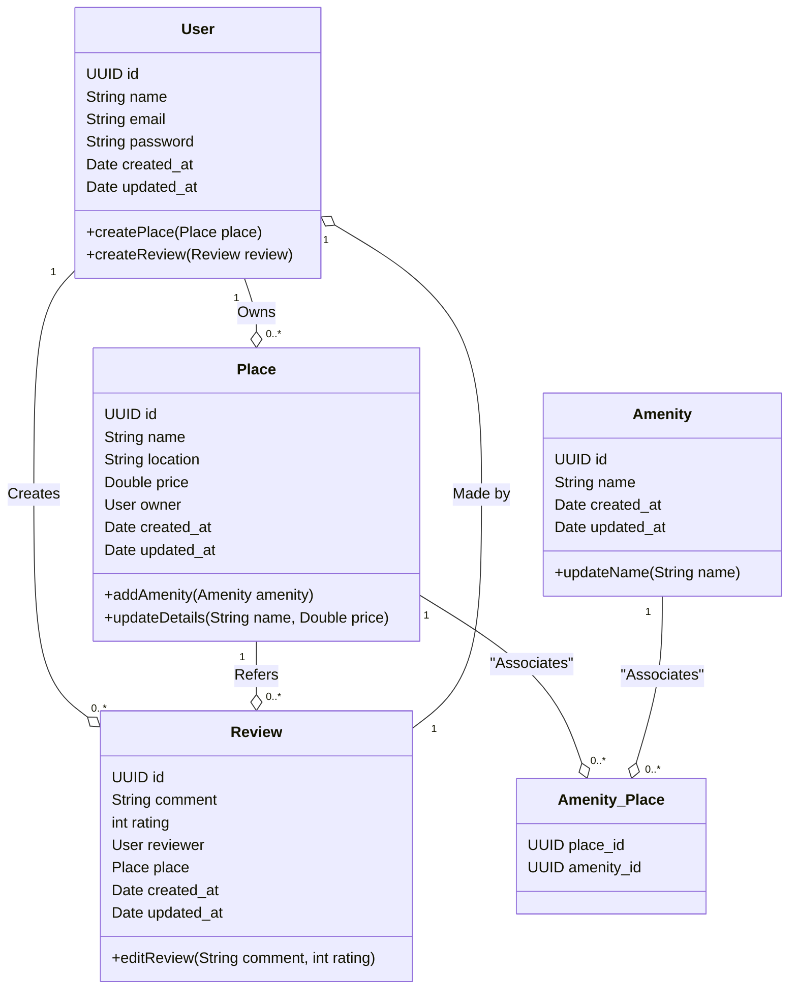

# Class diagram

```mermaid
classDiagram
    class User {
        UUID id
        String name
        String email
        String password
        Date created_at
        Date updated_at
        +createPlace(Place place)
        +createReview(Review review)
    }

    class Place {
        UUID id
        String name
        String location
        Double price
        User owner
        Date created_at
        Date updated_at
        +addAmenity(Amenity amenity)
        +updateDetails(String name, Double price)
    }

    class Amenity {
        UUID id
        String name
        Date created_at
        Date updated_at
        +updateName(String name)
    }

    class Review {
        UUID id
        String comment
        int rating
        User reviewer
        Place place
        Date created_at
        Date updated_at
        +editReview(String comment, int rating)
    }

    class Amenity_Place {
        UUID place_id
        UUID amenity_id
    }

    User "1" --o "0..*" Place : Owns
    User "1" --o "0..*" Review : Creates
    Place "1" --o "0..*" Review : Refers
    Review "1" --o "1" User : Made by
    Place "1" --o "0..*" Amenity_Place : "Associates"
    Amenity "1" --o "0..*" Amenity_Place : "Associates"
```

