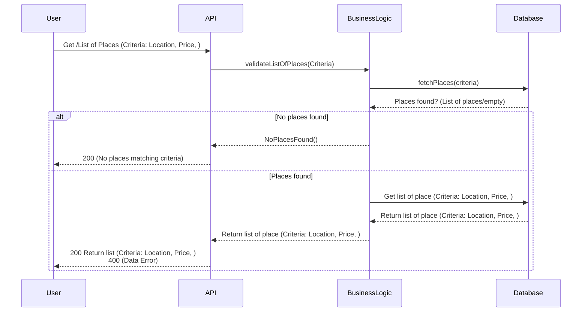

# Sequence List Diagram

```mermaid
sequenceDiagram
    participant User
    participant API
    participant BusinessLogic
    participant Database

    User->>API: Get /List of Places (Criteria: Location, Price, )
    API->>BusinessLogic: validateListOfPlaces(Criteria)
    BusinessLogic->>Database: fetchPlaces(criteria)
    Database-->>BusinessLogic: Places found? (List of places/empty)
    alt No places found
        BusinessLogic-->>API: NoPlacesFound()
        API-->>User: 200 (No places matching criteria)
    else Places found
        BusinessLogic->>Database: Get list of place (Criteria: Location, Price, )
        Database-->>BusinessLogic: Return list of place (Criteria: Location, Price, )
        BusinessLogic-->>API: Return list of place (Criteria: Location, Price, )
        API-->>User: 200 Return list (Criteria: Location, Price, ) <br />400 (Data Error)
    end
```

