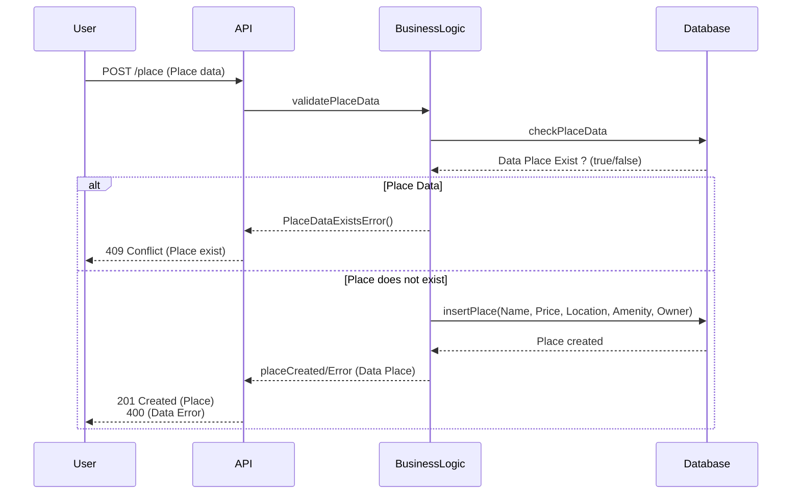

# Place Sequence Diagram

```mermaid
sequenceDiagram
    participant User
    participant API
    participant BusinessLogic
    participant Database

    User->>API: POST /place (Place data)
    API->>BusinessLogic: validatePlaceData
    BusinessLogic->>Database: checkPlaceData
    Database-->>BusinessLogic: Data Place Exist ? (true/false)
    alt Place Data
        BusinessLogic-->>API: PlaceDataExistsError()
        API-->>User: 409 Conflict (Place exist)
    else Place does not exist
        BusinessLogic->>Database: insertPlace(Name, Price, Location, Amenity, Owner)
        Database-->>BusinessLogic: Place created
        BusinessLogic-->>API: placeCreated/Error (Data Place)
        API-->>User: 201 Created (Place) <br />400 (Data Error)
    end
```

