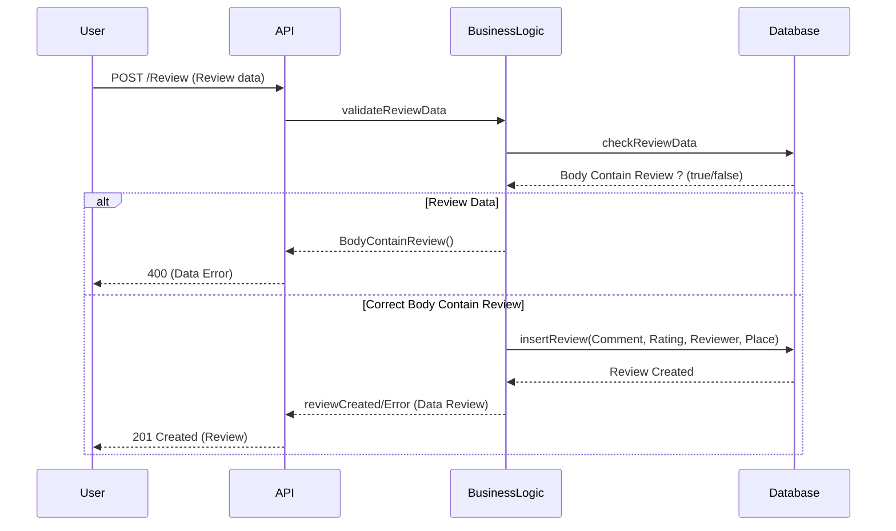

# Class Diagram Review

```mermaid
sequenceDiagram
    participant User
    participant API
    participant BusinessLogic
    participant Database

    User->>API: POST /Review (Review data)
    API->>BusinessLogic: validateReviewData
    BusinessLogic->>Database: checkReviewData
    Database-->>BusinessLogic: Body Contain Review ? (true/false)
    alt Review Data
        BusinessLogic-->>API: BodyContainReview()
        API-->>User: 400 (Data Error)
    else Correct Body Contain Review
        BusinessLogic->>Database: insertReview(Comment, Rating, Reviewer, Place)
        Database-->>BusinessLogic: Review Created
        BusinessLogic-->>API: reviewCreated/Error (Data Review)
        API-->>User: 201 Created (Review)
    end
```

