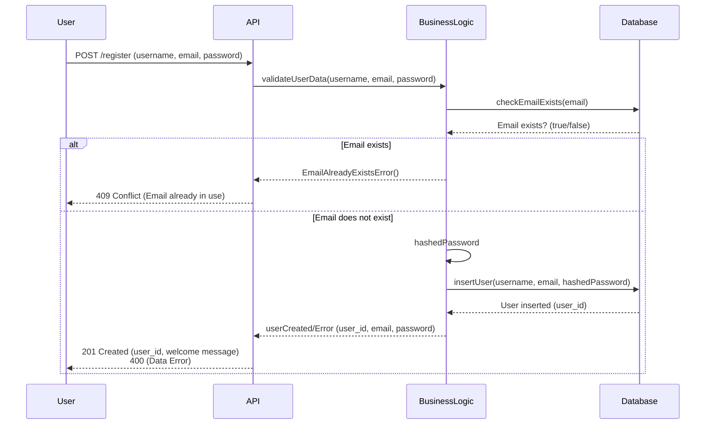

# User Class Diagram

```mermaid
sequenceDiagram
    participant User
    participant API
    participant BusinessLogic
    participant Database

    User->>API: POST /register (username, email, password)
    API->>BusinessLogic: validateUserData(username, email, password)
    BusinessLogic->>Database: checkEmailExists(email)
    Database-->>BusinessLogic: Email exists? (true/false)
    alt Email exists
        BusinessLogic-->>API: EmailAlreadyExistsError()
        API-->>User: 409 Conflict (Email already in use)
    else Email does not exist
        BusinessLogic->>BusinessLogic: hashedPassword
        BusinessLogic->>Database: insertUser(username, email, hashedPassword)
        Database-->>BusinessLogic: User inserted (user_id)
        BusinessLogic-->>API: userCreated/Error (user_id, email, password)
        API-->>User: 201 Created (user_id, welcome message) <br />400 (Data Error)
    end
```

